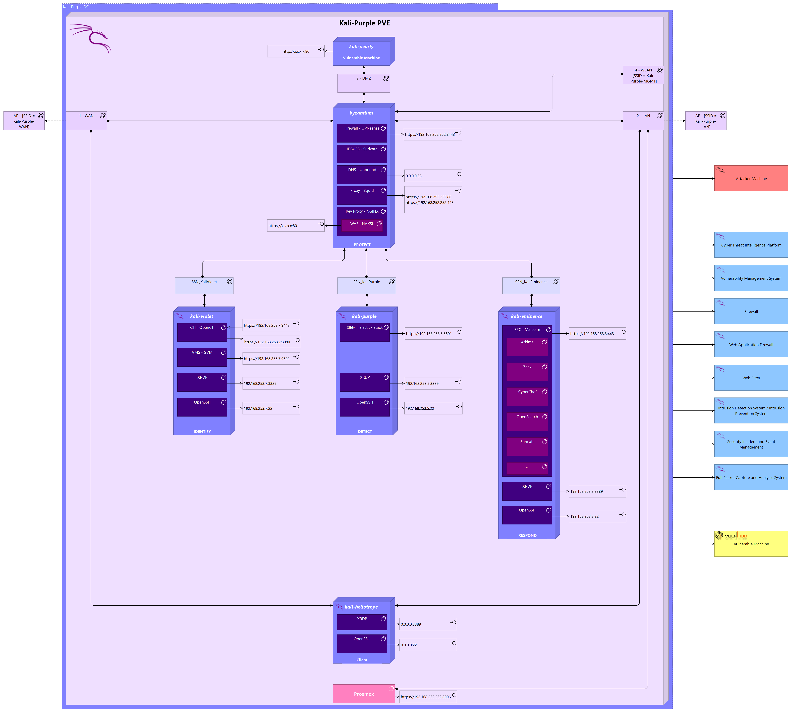

# kali_purple_on_proxmox
Automated deployment of the kali-purple SOC on proxmox

This is an automated delpoyment of the [kali-purple SOC](https://gitlab.com/kalilinux/kali-purple/documentation/-/wikis/home) on proxmox using terraform to create the VMs and ansible to deploy the software required to run the SOC 

## Architecture

## Environment

for this deployment we are using 1 proxmox server with the following resources

| hostname | cpu cores | ram | storage |
|:--------:|:---------:|:---:|:-------:|
|pve01|48|160 GB| 4.4 TB|

## Requirements

- terraform (>= 1.3.7)
- ansible (core >= 2.13.8)
- python (>= 3.8.10)

## deployment

